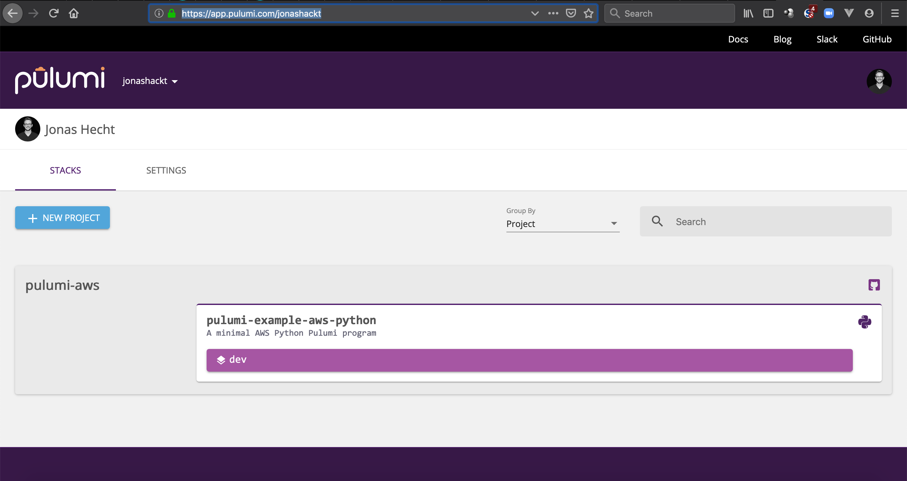

# pulumi-example-aws-python
Example project playing around with Pulumi

### What is Pulumi?

In contrast to other Infrastructure-as-Code tools, Pulumi uses real programming languages instead of YAML to define infrastructure code:

> At the center of Pulumi is an open-source cloud object model & an evaluation runtime (https://www.pulumi.com/docs/intro/concepts/)

This cloud object model is language agnostic to support multiple programming languages at the same time ([currently Node.js/JavaScript & Python. And there's a Preview for Go and the possibility to implement your own Language](https://www.pulumi.com/docs/intro/languages/)). The evaluation runtime is knows about the cloud resources and how to plan, manage & execute them.

Pulumi Project is a folder with a `Pulumi.yaml` - create with `pulumi new`. 

Pulumi Stacks are like stages (dev, stage, production).


## Prerequisites

https://www.pulumi.com/docs/get-started/aws/

Install Pulumi SDK:

`brew install pulumi`


## An example Project with AWS & Python

Let's create an Pulumi example project using Python and AWS. Therefore create an empty directory:

```
mkdir pulumi-aws-python-example
cd pulumi-aws-python-example
```

Now create a Pulumi project with: `pulumi new aws-python`. Then you're promted to login to Pulumi (for more info about that, visit https://www.pulumi.com/docs/troubleshooting/faq/#how-does-pulumi-depend-on-pulumi-com), if you run `pulumi new` for the first time:

```
Manage your Pulumi stacks by logging in.
Run `pulumi login --help` for alternative login options.
Enter your access token from https://app.pulumi.com/account/tokens
    or hit <ENTER> to log in using your browser                   :
```

I used GitHub to authorize Pulumi Cloud in my Browser:


Now the console needs our attention again - Pulumi want's to know about __project name__, __description__, __stack name__:

```
  Welcome to Pulumi!

  Pulumi  helps you create, deploy, and manage infrastructure on any cloud using
  your favorite language. You can get started today with Pulumi at:

      https://www.pulumi.com/docs/get-started/

This command will walk you through creating a new Pulumi project.

Enter a value or leave blank to accept the (default), and press <ENTER>.
Press ^C at any time to quit.

project name: (pulumi-aws) pulumi-example-aws-python
project description: (A minimal AWS Python Pulumi program)
Created project 'pulumi-example-aws-python'

Please enter your desired stack name.
To create a stack in an organization, use the format <org-name>/<stack-name> (e.g. `acmecorp/dev`).
stack name: (dev) jonashackt/dev
Created stack 'dev'
```

Then in case of AWS Pulumi needs a region to be used. For me I use `eu-central-1`:

```
aws:region: The AWS region to deploy into: (us-east-1) eu-central-1
Saved config
```

Now we're already finished:

```
Your new project is ready to go! ✨

To perform an initial deployment, run the following commands:

   1. virtualenv -p python3 venv
   2. source venv/bin/activate
   3. pip3 install -r requirements.txt

Then, run 'pulumi up'
```

Now you can also login to pulumi.com - I use `jonashackt` as the organisation, so you'll find my projects under: https://app.pulumi.com/jonashackt




### A clean Python environment with virtualenv

Before running `pulumi up`, you should install [virtualenv](https://virtualenv.pypa.io/en/latest/installation/), which is basically a project local dependency management for pip packages (this is also referred to as a good Python package dependency user style). If you're a Maven, Gradle, NPM user - think of a project local directory, where the all your dependecies are downloaded:

```
# On MacOS or Windows, simply do a
pip install virtualenv

# be more careful on Linux distros, e.g. use your distro's package manager for installation or use pip install --user virtualenv
```

Now we have to configure `virtualenv` to create the virtual pip environment - this will create a new directory `venv` inside your project folder:

```
virtualenv -p python3 venv
```

The `-p python3` option tells virtualenv to use the Python interpreter with version 3. Now we also need to `activate` the new isolated Python environment - and virtualenv provides us with a script to do so:

```
source venv/bin/activate
# OR .venv/bin/activate
```

`source` is just a synonym for `.`, which simply [executes something on a shell](https://superuser.com/a/46146/497608). To run a check, if you're using the isolated virtualenv's Python now, run a `pip3 -V`. It should contain the correct path to your project:

```
$ pip3 -V
pip 19.2.3 from /Users/jonashecht/dev/pulumi-aws/venv/lib/python3.7/site-packages/pip (python 3.7)

# whereas the non-isolated Python would give something like this (on MacOS using brew):
pip 19.1.1 from /usr/local/lib/python3.7/site-packages/pip (python 3.7)
# then something would be missing - try some research on https://virtualenv.pypa.io/en/latest/userguide/
```

Finally we are now installing this Pulumi project's dependencies with:

```
pip3 install -r requirements.txt
```


### Pulumi first run

Now we should have everything prepared to run Pulumi with `pulumi up`:

```
(venv)  jonashecht  ~/dev/pulumi-aws   master ●  pulumi up
Please choose a stack, or create a new one: dev
Previewing update (dev):

     Type                 Name                           Plan
 +   pulumi:pulumi:Stack  pulumi-example-aws-python-dev  create
 +   └─ aws:s3:Bucket     my-bucket                      create

Resources:
    + 2 to create

Do you want to perform this update? details
+ pulumi:pulumi:Stack: (create)
    [urn=urn:pulumi:dev::pulumi-example-aws-python::pulumi:pulumi:Stack::pulumi-example-aws-python-dev]
    + aws:s3/bucket:Bucket: (create)
        [urn=urn:pulumi:dev::pulumi-example-aws-python::aws:s3/bucket:Bucket::my-bucket]
        [provider=urn:pulumi:dev::pulumi-example-aws-python::pulumi:providers:aws::default_1_5_0::04da6b54-80e4-46f7-96ec-b56ff0331ba9]
        acl         : "private"
        bucket      : "my-bucket-58790f7"
        forceDestroy: false

Do you want to perform this update?
```

After choosing a stack to perform the action on, Pulumi outlines everything it will do when we choose `yes` to perform the update. Open the `details` to see everything in much more depth.

Then choose `yes` and Pulumi runs the update:

```
Updating (dev):

     Type                 Name                           Status
 +   pulumi:pulumi:Stack  pulumi-example-aws-python-dev  created
 +   └─ aws:s3:Bucket     my-bucket                      created

Outputs:
    bucket_name: "my-bucket-33cba3e"

Resources:
    + 2 created

Duration: 9s

Permalink: https://app.pulumi.com/jonashackt/pulumi-example-aws-python/dev/updates/1
```

You can have a look at the link provided and you'll see your Pulumi console:


The example project creates a S3 bucket, which you could also check out by clicking onto the `Open in AWS console` button:


That's it: this is our first Cloud resource created by Pulumi!


### Test-driven Development with Pulumi


## Links

Also see https://www.pulumi.com/docs/tutorials/aws/ec2-webserver/


